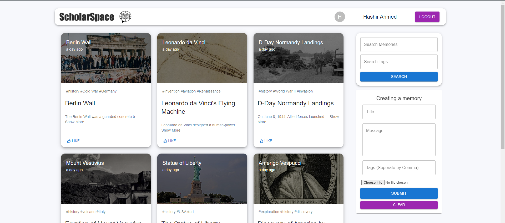
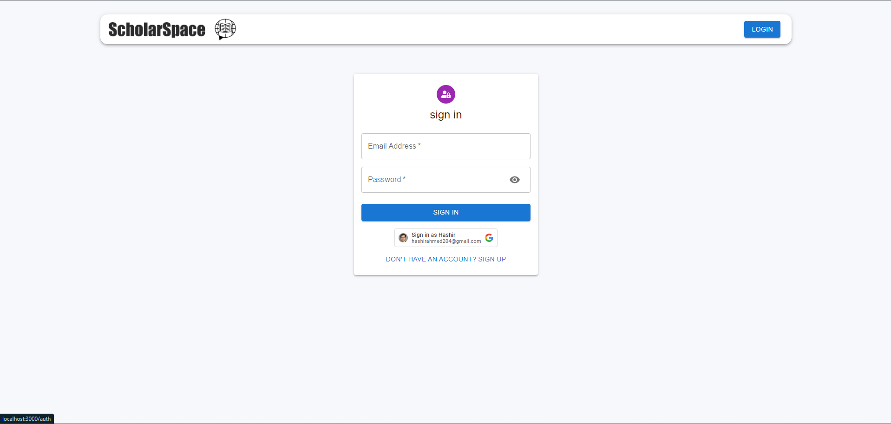
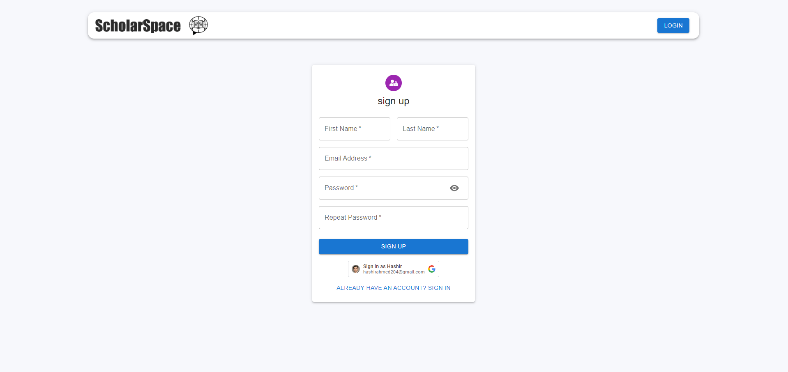
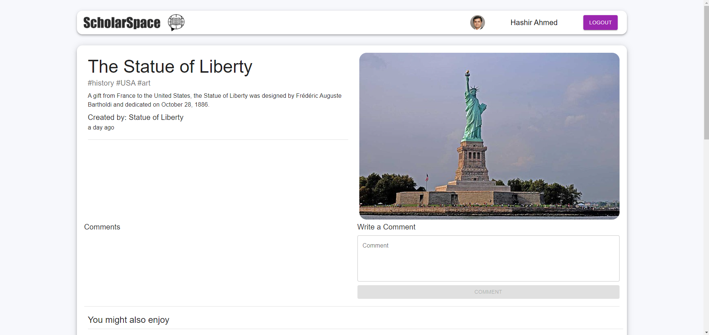
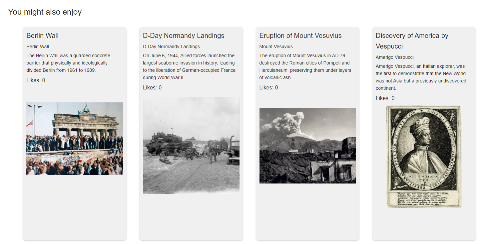

# Online Learning Platform

## Description

This project is a full-stack web application built using the MERN stack (MongoDB, Express.js, React.js, Node.js) along with Apollo GraphQL. It is designed as an online learning platform with features reminiscent of a social media platform, allowing users to interact with posts and other users.

## Images

#### Home Page



#### Login Page



#### SignUp Page



#### Post Details Page



#### Recomended Section



## Features

- **Authentication**: Users can sign up, log in, and log out securely. It also includes integration with Google OAuth for easy registration and login.
- **User Profiles**: Users have their profiles where they can view their posts, edit personal information, and create/edit posts.
- **Search Functionality**: Users can search for posts based on keywords, categories, or topics.
- **Social Interaction**: Users can like, comment, and share posts with others.

## Technologies Used

- **Frontend**:
  - React.js
  - Apollo Client (GraphQL client)
  - HTML/CSS
- **Backend**:
  - Node.js
  - Express.js
  - Apollo Server (GraphQL server)
  - MongoDB (with Mongoose ORM)
- **Authentication**:
  - JWT (JSON Web Tokens)
- **Deployment**:
  - TBD
- **Other Tools**:
  - Git (Version control)
  - ESLint, Prettier (Code linting and formatting)
  - NPM (Package management)

## Getting Started

### Prerequisites

- Node.js installed on your machine
- MongoDB Atlas account for the database
- Google Developer Console project for OAuth integration

### Installation

1. Clone the repository: `git clone <repository-url>`
2. Navigate to the project directory: `cd OLP_MERN`
3. Install dependencies for both the frontend and backend:
   ```bash
   cd client
   npm install
   cd server
   npm install
   ```

### Setup Environment Variables

- Create a .env file in the server directory and define the following variables:

```makefile
    PORT=4000
    MONGODB_URI=<your-mongodb-uri>
    JWT_SECRET=<your-jwt-secret>
    GOOGLE_CLIENT_ID=<your-google-client-id>
    GOOGLE_CLIENT_SECRET=<your-google-client-secret>
```

### Running the project

- Run the following commands

```bash
   cd server
   npm run dev
   cd client
   npm start
```
